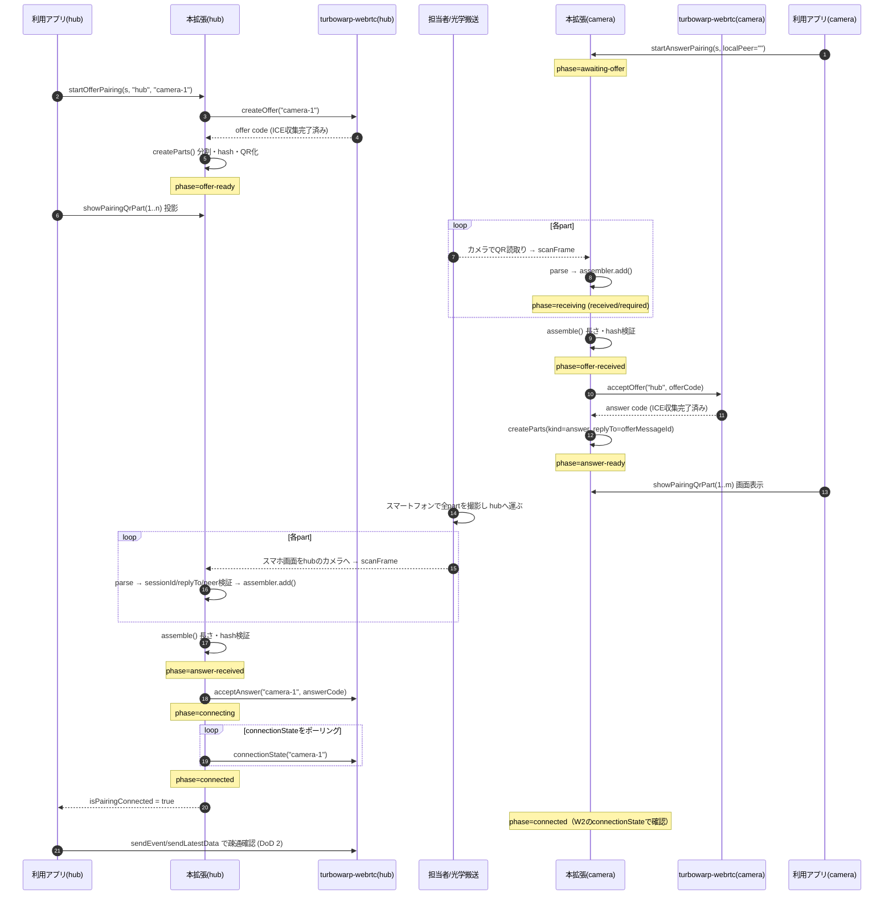
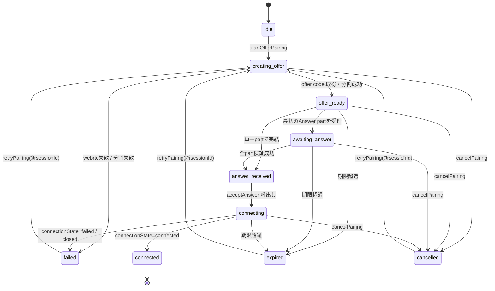
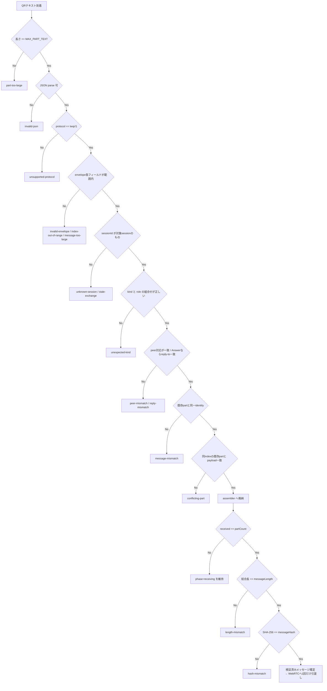
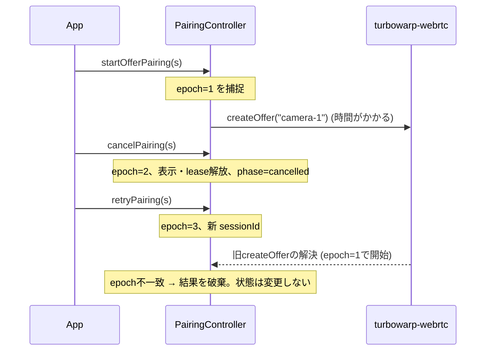
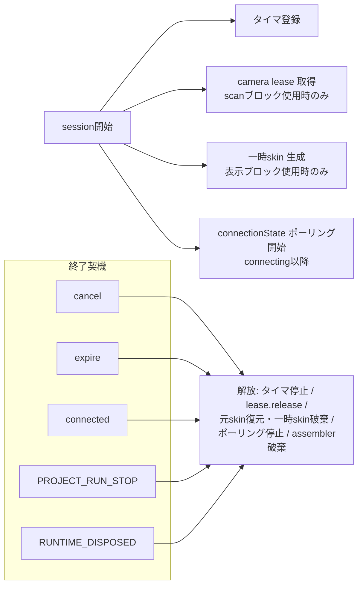

# データフローと状態遷移

対応要求: FR-1 / FR-3 / FR-4 — [requirements.md](requirements.md)

## 1. 全体シーケンス（正常系・DoD 1）

## 2. 状態遷移（hub）

`offer_ready`／`awaiting_answer`は「Offerを表示しながらAnswerを待つ」段階で、
表示の有無は`pairingQrPartCount`／`pairingQrCurrentPart`、受信進捗は
`pairingReceivedParts`／`pairingRequiredParts`／`pairingMissingParts`で別々に観測する。

## 3. 状態遷移（camera）

```mermaid
stateDiagram-v2
  [*] --> idle
  idle --> awaiting_offer: startAnswerPairing
  awaiting_offer --> receiving: 最初のOffer partを受理
  receiving --> receiving: 追加part / 重複part
  awaiting_offer --> offer_received: 単一partで完結
  receiving --> offer_received: 全part検証成功
  offer_received --> creating_answer: acceptOffer 呼出し
  creating_answer --> answer_ready: answer code 取得・分割成功
  creating_answer --> failed: webrtc失敗 / 分割失敗
  answer_ready --> connecting: 表示完了後もconnectionStateを監視
  connecting --> connected: connectionState=connected
  connecting --> failed: connectionState=failed / closed
  awaiting_offer --> expired: 期限超過
  receiving --> expired: 期限超過
  answer_ready --> expired: 期限超過
  awaiting_offer --> cancelled: cancelPairing
  receiving --> cancelled: cancelPairing
  answer_ready --> cancelled: cancelPairing
  cancelled --> awaiting_offer: retryPairing
  expired --> awaiting_offer: retryPairing
  failed --> awaiting_offer: retryPairing
  connected --> [*]
```

**FR-4.2の分離**: QR読取り完了は`offer_received`／`answer_received`、
WebRTC接続成立は`connected`。両者は必ず別の状態として観測できる。

## 4. part受理の判定フロー（FR-2.3 / FR-2.5）

重複partで`payload`が一致する場合は`duplicate=true`を返し、エラーにはしない（正常系）。

## 5. 古い非同期結果の破棄（FR-4.4）

同じ仕組みを`acceptOffer`／`acceptAnswer`／分割処理／connectionStateポーリングにも適用する。

## 6. 資源の取得と解放

`connected`到達時も走査・表示・タイマは解放するが、RTCPeerConnectionは維持する。
`RUNTIME_DISPOSED`ではruntimeイベントリスナも解除する。
